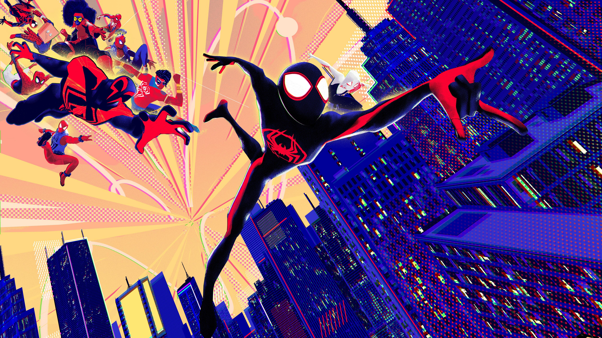

# Awesome Wallpapers Collection

Welcome to the **Awesome Wallpapers Collection**! 🎨📸 This repository is a curated collection of stunning wallpapers that you can use to beautify your desktop, mobile devices, or any other screen. Whether you're looking for nature scenes, abstract art, or minimalistic designs, you'll find something here to suit your taste.

## Table of Contents

- [Features](#features)
- [Gallery](#gallery)
- [Usage](#usage)
- [Contributing](#contributing)
- [License](#license)

## Features

- **Diverse Collection**: A wide range of wallpapers in various categories including nature, abstract, landscapes, and more.
- **High Resolution**: All wallpapers are available in high resolution to ensure they look great on any screen.
- **Easy to Navigate**: Organized folders for easy browsing and downloading.

## Gallery

Here are a few examples of what you can find in this repository:

## Usage

To use these wallpapers, simply follow these steps:

1. Browse through the folders to find a wallpaper you like.
2. Click on the image to view it in full size.
3. Download the image by right-clicking and selecting "Save image as..." or using the download button.

## Contributing

Contributions are welcome! If you have some amazing wallpapers you'd like to share, feel free to fork the repository and submit a pull request. Please ensure that your contributions adhere to the following guidelines:

- Only include wallpapers that you have the right to share.
- Provide a brief description of each wallpaper in the pull request.

## Acknowledgment

Please note that the wallpapers in this collection are not my own creations. They have been collected from various sources on the internet. I would like to express my gratitude to the original authors and artists for their incredible work. If you recognize your work here and would like it removed or credited differently, please let me know.

## License

This repository is licensed under the [MIT License](LICENSE). Feel free to use the wallpapers for personal and commercial projects, but please give credit where it's due.

## Contact

For any inquiries or suggestions, feel free to reach out to me at [sharavanasudhanj@yahoo.com](mailto:sharavanasudhanj@yahoo.com).

---

Happy browsing and enjoy your new wallpapers! 🌟
